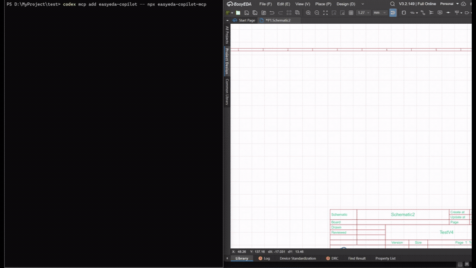
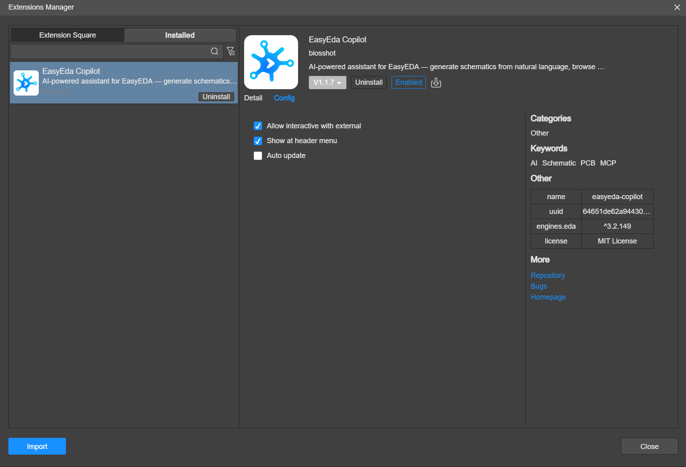

[English](README.md) | [简体中文](README.zh-CN.md) | Русский
# EasyEDA Copilot
Ассистент для EasyEDA Pro и JLCEDA на базе ИИ. Подключает MCP-агента к EasyEDA для создания и изменения схем, поиска компонентов, проектирования и трассировки PCB, инспекции результатов и запуска DRC.

> [!IMPORTANT]
> **MCP — рекомендуемый и активно развиваемый интерфейс EasyEDA Copilot.** Он надёжнее для агентных сценариев и предоставляет полный набор возможностей, включая работу с PCB, checkpoints, документами, инспекцией и DRC. Встроенный Interface остаётся доступным для тех, кому нравится этот способ работы, но теперь считается legacy и получает ограниченную поддержку.

<p align="center">
  <a href="https://github.com/biosshot/easyeda-copilot/releases/latest">
    
  </a>
  <a href="https://github.com/biosshot/easyeda-copilot/blob/main/LICENSE">
    
  </a>
  <a href="https://discord.gg/AXCGjTDYkq">
    
  </a>
</p>

<p align="center">
  
</p>

## Возможности Copilot
EasyEDA Copilot добавляет новый уровень AI-проектирования в EasyEDA Pro:
- **Генерация схем по текстовому описанию**: опишите нужную схему и позвольте MCP-агенту собрать предложенный вариант.
- **Доработка существующих схем**: агент читает открытую страницу и может добавлять, заменять, соединять и перегруппировывать компоненты.
- **Поиск компонентов в LCSC**: находит элементы из текстового запроса по нужным характеристикам и требованиям.
- **Применение переиспользуемых блоков**: включает проверенные типовые подсхемы, такие как стабилизаторы, интерфейсы и блоки защиты.
- **Объяснение и анализ схем**: объясняет поведение схем, прохождение сигнала и компромиссы при проектировании.
- **Проектирование печатных плат**: формирует и показывает размещение, собирает плату, выполняет трассировку, проверяет результат и запускает DRC.
- **Безопасное изменение проекта**: сохраняет и восстанавливает checkpoints, откатывает неудачную перегруппировку схемы и контролирует длительные PCB-операции.
- **Управление проектом**: читает дерево проекта, открывает и синхронизирует документы, выбирает целевое окно при нескольких подключённых экземплярах EasyEDA.

Больше примеров доступно на [Oshwlab](https://oshwlab.com/biosshot/edacopilotexamples).

## Быстрый старт с MCP
Загрузите `.eext` последней сборки из [Releases](https://github.com/biosshot/easyeda-copilot/releases/latest).

В EasyEDA Pro:
1. Откройте `Settings -> Extensions -> Extensions Manager`.
2. Нажмите `Import Extensions`.
3. Выберите скачанный `.eext` файл.
4. Разрешите `External Interactions`, как показано в разделе [Разрешения расширения](docs/settings.md#extension-permissions).

<p align="center">
  <a href="docs/media/params.png">
    
  </a>
</p>

Добавьте MCP-сервер к агенту:

Codex:
```bash
codex mcp add easyeda-copilot -- npx -y easyeda-copilot-mcp
```

Claude Code:

```bash
claude mcp add easyeda-copilot -- npx -y easyeda-copilot-mcp
```

Затем:

1. Запустите Codex, Claude Code или другой MCP-клиент с включённым сервером.
2. Откройте целевую схему или документ PCB в EasyEDA Pro.
3. Попросите агента работать с открытым документом EasyEDA.

Расширение сканирует `ws://127.0.0.1:8787` каждые 5 секунд и подключается автоматически, когда MCP-сервер доступен. `Copilot -> MCP` не открывает отдельный интерфейс — этот пункт только приостанавливает или возобновляет сканирование.

Общая JSON-конфигурация, локальная сборка и подробный PCB workflow описаны в [README пакета MCP](mcp/README.ru.md).

## MCP и встроенный Interface (legacy)

| Возможность | MCP | Встроенный Interface |
| --- | --- | --- |
| Генерация и изменение схем | Да | Да, legacy workflow |
| Поиск компонентов и reusable blocks | Да | Да |
| Checkpoints и автоматическое восстановление | Да | Ограниченно |
| Управление проектом и документами | Да | Нет |
| Размещение, preview и сборка PCB | Да | Нет |
| Трассировка, инспекция, слои и DRC | Да | Нет |
| Несколько подключённых экземпляров EasyEDA | Да | Нет |
| Приоритет разработки | Основной | Ограниченная поддержка |

Во встроенный Interface вложено много сил, и он остаётся полезным для пользователей, которым нравится интегрированный чат и UI для SPICE. Он доступен через `Copilot -> Interface (Legacy)`. Новым пользователям и при воспроизведении ошибок рекомендуется начинать с MCP: в нём больше возможностей, а соединение, очереди команд, тайм-ауты и восстановление обрабатываются надёжнее.

<p align="center">
  
</p>

## Работа с PCB (только через MCP)

Размещение компонентов на печатной плате доступно только через внешний MCP-клиент, такой как Codex или Claude Code. Эта функция недоступна во встроенном чате Copilot.

MCP формирует размещение: контур платы, механические ограничения, компоненты, монтажные отверстия, контактные площадки и позиционные обозначения. Оцените механический предварительный просмотр, утвердите окончательное размещение, а затем импортируйте его в EasyEDA. После сборки MCP может запустить встроенный автотрассировщик, проверить объекты печатной платы и запустить DRC EasyEDA на открытом документе рабочего стола.

Сборка печатных плат, предварительный просмотр и поддержка трассировки через клиент проверяются с помощью **EasyEDA Desktop V3.2.149**.

### Плата RP2040: Copilot и Quilter

<p align="center">
  
  
</p>
<p align="center">
  
  
</p>

### Компактная плата PICO Duck: Copilot и Quilter

<p align="center">
  
  
</p>
<p align="center">
  
  
</p>

### Плата ESPower: Copilot и Quilter

<p align="center">
  
  
</p>
<p align="center">
  
  
</p>

## Совместимость

| Версии EasyEDA Pro  | Статус    |
| ------------------- | --------- |
| Desktop V3.2.149    | Проверено |
| Desktop V2.2.45     | Проверено |
| Desktop V2.2.47     | Проверено |

## Особенности

### Генерация схем

Формирует схему на основе текстового описания. Copilot может планировать схему, искать компоненты, создавать структурированный результат и предоставлять действие `Assemble circuit`, когда генерируемая схема готова.

<p align="center">
  
</p>

### Доработка схемы

Используйте Copilot для работы с уже существующим фрагментом схемы. Позвольте ему исправить пропущенный блок, добавить компоненты, соединить сигналы или запросите предложения по доработке схемы на основе выбранного контекста.

<p align="center">
  
  
</p>

### Выбор компонентов

Поиск в LCSC по смыслу запроса вместо ручной настройки фильтров каталога. Примеры:

- `find 5V relay`
- `Find DC-DC chip 5V and 10A current`
- `find capacitor 22uF Murata SMD 1210`

<p align="center">
  
  
  
</p>

### Переиспользуемые блоки

Переиспользуемые блоки — это проверенные фрагменты схем, которые агент может адаптировать и вставлять в генерируемые схемы. Они полезны для стандартных подсхем, в которых топология остается неизменной, а меняются только выводы или номиналы пассивных элементов.

Читайте [Документацию по переиспользуемым блокам](docs/reusable-blocks.md).

### SPICE-симуляция

Copilot может выполнять SPICE-симуляцию и автоматически выбирать модели из библиотеки моделей компонентов.

Всегда проверяйте SPICE-модели, используемые для заменяемых компонентов. Выбранные модели отображаются под графиком после завершения моделирования.

<p align="center">
  
</p>

## Документация

- [Настройки](docs/settings.md)
- [Прикрепление схем к AI-агенту](docs/attaching-circuits.md)
- [Сборка схемы от AI-агента](docs/assembling-circuits.md)
- [Переиспользуемые блоки](docs/reusable-blocks.md)
