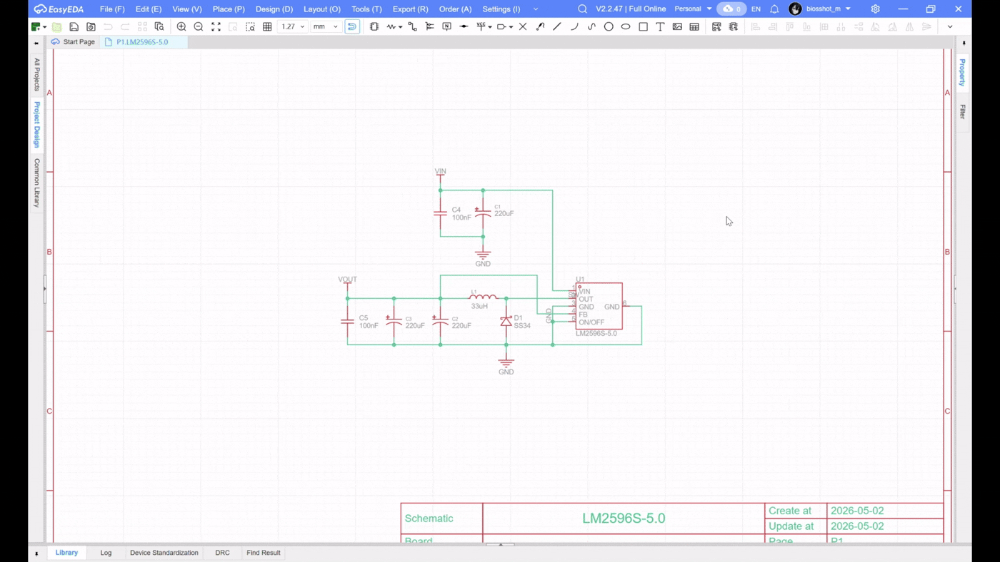
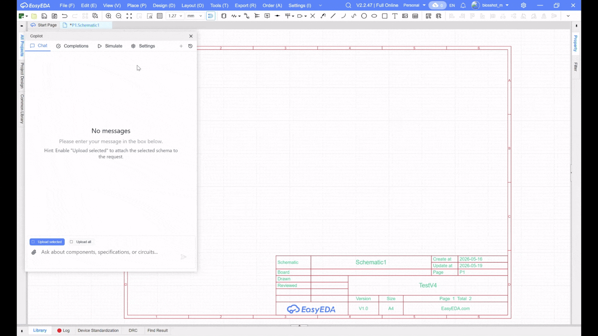

# Reusable blocks

A reusable block is a verified schematic fragment that EasyEDA Copilot can find, adapt and insert into a generated circuit. It is useful for repeated standard solutions: DC/DC converters, LDO blocks, level shifters, sensor front ends, interfaces, filters, protection circuits and other blocks where the topology stays the same, but several values or external connections change from project to project.

The core idea is simple: create a good reference schematic once, describe its ports and recalculation parameters, then save it as a reusable block. Later, the AI agent can find this block, select it for a suitable task, recalculate allowed values and connect it to the rest of the circuit.



## Why reusable blocks matter

Reusable blocks give the agent a known-good starting point instead of forcing it to synthesize every common circuit from scratch.

Benefits:

- **Higher reliability**: the agent reuses a reviewed schematic topology instead of inventing it every time.
- **Lower hallucination risk**: critical circuit fragments can come from reusable, reviewed blocks.
- **Faster generation**: a whole subcircuit is selected and adapted as one unit.
- **Consistent schematic style**: repeated solutions keep the same component choices, naming and organization.
- **Parameter adaptation**: passive values can be recalculated for the requested voltage, current, frequency or other declared parameters.

The agent can still build a circuit manually if no suitable reusable block exists.

## What can be recalculated

Recalculation is intended for passive components:

- resistors;
- capacitors;
- inductors.

Active components, ICs, connectors and mechanical elements should normally stay fixed. If a block needs another IC or another topology, create a separate reusable block or let the agent design that part manually.

## How it works

Each block contains:

- **name** and **description**: what the block does and when to use it;
- **category** and **tags**: how the block is grouped and discovered;
- **ports**: external nets such as `VIN`, `VOUT`, `GND`, `EN`, `SCL`, `SDA`;
- **parameters**: numeric values such as `VIN`, `VOUT`, `ILOAD`, `FREQ`;
- **component recalculation formulas**: rules for passive values that change when parameters change;
- **LCSC query templates**: search text for finding a suitable replacement passive part after recalculation.

Clear metadata improves block discovery, so the name, description, category and tags should describe the real function and likely user requests.

When reusable blocks are enabled in settings, the circuit-making agent can use them for standard subcircuits. It should prefer a suitable reusable block over designing the same standard block manually.

When a reusable block is used, Copilot:

1. Applies the parameters requested by the agent.
2. Checks that changed parameters are allowed to be recalculated.
3. Checks `min` and `max` bounds when they are defined.
4. Replaces port templates with real net names.
5. Evaluates formulas for recalculated components.
6. Updates component values and search queries.
7. Adds the resulting subcircuit to the generated schematic.

If the agent does not connect a port, Copilot assigns it an internal `NC_*` net so it does not accidentally connect to another signal.



## Add a reusable block

### 1. Prepare a reference schematic

First, create the standard circuit in EasyEDA. Choose a topology that is worth reusing and has clear external connections.

Good candidates:

- reference designs from datasheets;
- already verified project fragments;
- internal templates used repeatedly across boards;
- blocks where adaptation only requires changing passive values.

Before export, make sure external connections have meaningful net names. For example, `VIN`, `VOUT`, `GND`, `EN`, `SCL`, `SDA` are much easier to map than anonymous nets.

### 2. Open the export tool

In EasyEDA, open:

`Copilot` -> `Reused blocks` -> `Export`

The reusable block editor has two main tabs:

- `Browse`: read-only list of existing reusable blocks;
- `Export`: editor for creating a new reusable block.

### 3. Load the schematic

In the `Export` tab, click `Load from EasyEDA`. The editor reads the current schematic and fills the component list.

You can also use `Load from file` if you already have a JSON export, and `Save to file` to keep an intermediate draft before saving the block.

### 4. Fill block metadata

Set:

- **Block Name**: concise technical name, for example `LM2596 buck converter`.
- **Description**: topology, main IC, intended use and operating range.
- **Category**: broad group such as `power-management` or `communication-interfaces`.
- **Tags**: specific labels such as `buck-converter`, `ldo-regulator`, `i2c-interface`.

Search uses this text, so avoid vague descriptions like "power circuit". Prefer phrases that a user or agent would actually search for: "3.3 V buck converter", "RS-485 transceiver interface", "I2C bidirectional level shifter".

### 5. Define ports

Ports are the block's external connection points. Add every signal that the generated circuit may need to connect.

Typical examples:

- power block: `VIN`, `VOUT`, `GND`, `EN`, `PGOOD`;
- I2C level shifter: `VCCA`, `VCCB`, `SDA_A`, `SCL_A`, `SDA_B`, `SCL_B`, `GND`;
- op-amp filter: `IN`, `OUT`, `VCC`, `VEE`, `GND`.

In component pins, bind nets to ports with templates:

```text
{PORT_VIN}
{PORT_VOUT}
{PORT_GND}
```

All identical `signal_name` values are replaced together. This is how the agent connects the block to project nets such as `+12V_IN`, `+3V3`, `MCU_I2C_SDA` or `GND`.

### 6. Define parameters

Parameters are numeric values that describe operating conditions or design targets.

Each parameter has:

- **Min**: optional lower bound;
- **Nominal**: value used by the current reference schematic;
- **Max**: optional upper bound;
- **Allow recalc**: whether the AI agent may change this parameter.

Examples:

| Parameter | Meaning | Allow recalc |
| --- | --- | --- |
| `VIN` | input voltage | sometimes |
| `VOUT` | output voltage | yes |
| `ILOAD` | output current | sometimes |
| `FREQ` | switching frequency | only if formulas and components support it |

Enable `Allow recalc` only when the formulas and selected components really support the whole declared range.

### 7. Add component recalculation formulas

For every passive component that should change with parameters, add recalculation metadata:

- **Formula**: mathematical expression using `PARAM_` variables and current component values.
- **Unit**: measurement unit appended to the computed value.
- **LCSC Query Template**: search text used to find the replacement component.

Example for a feedback resistor:

```text
formula: 100 * (PARAM_VOUT / 1.23 - 1)
unit: kOhm
lcsc_query_template: resistor {value} smd 0603 1%
```

Available values include:

- `PARAM_VOUT`, `PARAM_VOUT_min`, `PARAM_VOUT_max`;
- `PARAM_VIN`, `PARAM_ILOAD` and other declared parameters;
- numeric component values such as `R1`, `C2`, `L1`, extracted from their current `value`;
- component string fields as template variables, for example `{R1_value}`.

The calculated result must be positive. Copilot formats it with two decimal places and appends the unit, for example `12.34kOhm`.

### 8. Use Auto fill with AI as a draft

`Auto fill with AI` can generate:

- block name and description;
- category and tags;
- ports;
- parameters and ranges;
- signal renaming operations;
- component recalculation formulas.

Treat this as a draft. Always review the result, especially:

- whether every external net is mapped to the correct `{PORT_*}`;
- whether `min` and `max` ranges are realistic;
- whether `allow_recalc` is enabled only where it is safe;
- whether formulas match the datasheet;
- whether LCSC query templates include package, tolerance, voltage rating or power rating when required.

### 9. Save the block

Click `Add to database` to save the reusable block.

Review the saved block before relying on it in generated circuits.

## Browse and export existing blocks

Open `Copilot` -> `Reused blocks` and use the `Browse` tab.

The browser shows:

- total number of blocks;
- current page;
- category and tags;
- component count and parameter names.

You can download:

- block data for review or backup;
- circuit assembly data for schematic inspection.

## Enable AI agent usage

In Copilot settings, enable:

`Add reused block to agent tools (Beta)`

After this, the circuit-making agent can use reusable blocks. For standard units, it is instructed to prefer a suitable reusable block over manual design of the same subcircuit. In the generated result UI, used blocks are shown in the `Reused blocks` section with their name, category and tags.

## Quality practices

- Keep one block focused on one clear function.
- Write clear metadata because it directly affects block discovery.
- Prefer reference circuits from datasheets.
- Do not expose internal nets as ports.
- Use stable, semantic port names.
- Keep parameter ranges conservative.
- Recalculate only the minimum necessary set of passive components.
- Include package, tolerance, voltage/current rating or power rating in LCSC query templates when it matters.
- Save a file draft before adding complex blocks.
- Test the block with a small prompt before relying on it in larger circuits.

## Common mistakes

- **Wrong port template**: a net was not renamed to `{PORT_*}`, so the agent cannot connect the block correctly.
- **Too many recalculable parameters**: the block looks flexible, but formulas do not cover the whole range.
- **Weak description**: Copilot cannot match the block to natural-language user requests.
- **Units inside formulas**: formulas operate on numbers; the unit is appended separately.
- **Expecting active component replacement**: recalculation does not change the IC or block topology.

## Quick checklist

Before saving, verify:

- metadata describes the real circuit and likely search phrases;
- all external nets are modeled as ports;
- all ports are used in `signal_name` through templates;
- every recalculable parameter has realistic bounds;
- formulas are checked against the datasheet;
- `recalc` is used only for passive components;
- LCSC queries are specific enough to find suitable parts;
- the block is reviewed before agent use.
